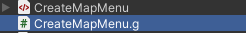
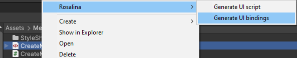

# How to use Rosalina

### UI-Script
To create the UI-Script, which will contain your code, right-click on the ``Visual Tree Asset`` file.
There, choose ``Rosalina -> Generate UI script``

All custom code can be implemented in this file, as it won't be changed when the UI is modified.

### UI-Bindings
After installing Rosalina, the plugin will automatically create a Bindings-Script when ever yous save a ``Visual Tree Asset``.
The generated file will be located next to your ``Visual Tree Asset`` and share it's name.

You should ``not`` edit this file in any way or form, as it will be recreated on each change to the corresponding ``Visual Tree Asset`` document.

If this file is not generated automatically, you can generate it by right-clicking it the ``Visual Tree Asset`` file and select ``Rosalina -> Generate UI bindings``

### Limitations

- The generated files share the name of the ``Visual Tree Asset``. Currently, it's not possible to change the script names.
- While it's possible to change the path of the UI-Script, the UI-Bindings can currently not be moved.
- Rosalina currently does not support namespaces.
- It's currently not possible to deactivate the generation of UI-Bindings on ``Visual Tree Asset`` save.