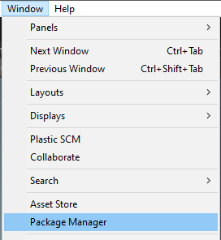
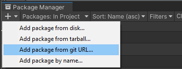
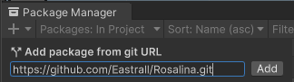

# How to install Rosalina

## Installing via OpenUPM

Rosalina is now available via OpenUPM:
https://openupm.com/packages/com.eastylabs.rosalina/

OpenUPM provides a detailed explanation of how to add packages to unity.
Just follow the guide in the link:

## Installing via git repository

In Unity, navigate to ``Window -> Package Manager``:

In the ``Package Manager``, click on the ``+`` on the top left and select ``Add package from git URL...``

No use the following path to install Rosalina ``https://github.com/Eastrall/Rosalina.git``

You can now start to work with Rosalina.